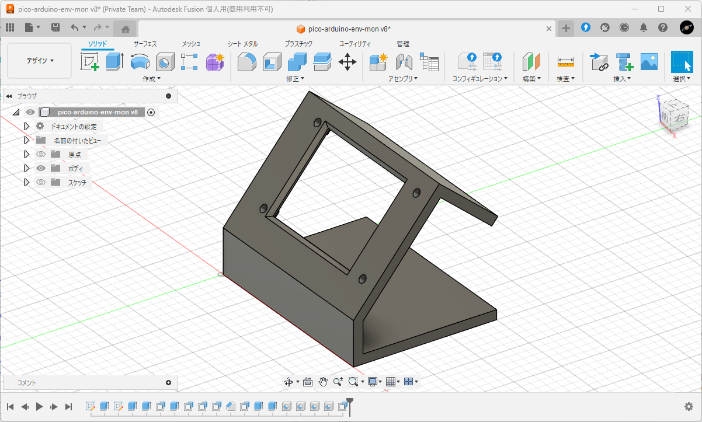

# pico-arduino-env-mon

秋月電子通商で買える部品だけで作れる環境モニタです。

温度、湿度、気圧、CO2濃度を定期的に取得し、24時間のトレンドグラフとともに表示します。

こちらの環境モニタ (MIT license) を参考に製作しました。
* [shapoco / pico-env-mon](https://github.com/shapoco/pico-env-mon)
  * ReadMe.md を一部流用させていただきました。 
  * グラフ描画処理を参考にさせていただきました。

## 作例

3Dプリンタで作ったケースに収めた例です。

基板の作例は [こちらの img ディレクトリ](img/) を参照してください。


## 使用部品

<table>
  <tr>
    <th>項目</th>
    <th>型番・仕様</th>
    <th>購入先 (例)</th>
    <th>備考</th>
  </tr>
  <tr>
    <td rowspan="2">マイコン (どちらか)</td>
    <td>秋月 AE-RP2040</td>
    <td>
      秋月: <a href="https://akizukidenshi.com/catalog/g/g117542/" target="_blank">117542</a>
    </td>
    <td rowspan="2">AE-RP2040で動作確認済み</td>
  </tr>
  <tr>
    <td>Raspberry Pi Pico</td>
    <td>
      秋月: <a href="https://akizukidenshi.com/catalog/g/g116132/" target="_blank">116132</a>
    </td>
  </tr>
  <tr>
    <td>LCD</td>
    <td>MSP2807</td>
    <td>
      秋月: <a href="https://akizukidenshi.com/catalog/g/g116265/" target="_blank">116265</a>
    </td>
    <td>ILI9341 搭載 LCD</td>
  </tr>
  <tr>
    <td>温湿度・気圧センサ</td>
    <td>AE-BME280</td>
    <td>
      秋月: <a href="https://akizukidenshi.com/catalog/g/g109421/" target="blank">109421</a>
    </td>
    <td></td>
  </tr>
  <tr>
    <td>CO2 センサ</td>
    <td>MH-Z19C</td>
    <td>
      秋月: <a href="https://akizukidenshi.com/catalog/g/g116142/" target="blank">116142</a>
    </td>
    <td>*1</td>
  </tr>
  <tr>
    <td>ゼロ点補正スイッチ</td>
    <td>適当なタクトスイッチ</td>
    <td>
      秋月: <a href="https://akizukidenshi.com/catalog/c/cpushsw/" target="blank">検索</a>
      (例: <a href="https://akizukidenshi.com/catalog/g/g103647/" target="blank">103647</a>)
    </td>
    <td></td>
  </tr>
  <tr>
    <td>部品固定用<br>ピンヘッダ</td>
    <td>PH-1x40SG</td>
    <td>
      秋月: <a href="https://akizukidenshi.com/catalog/g/g100167/" target="blank">100167</a>
    </td>
    <td></td>
  </tr>
  <tr>
    <td>部品固定用<br>ピンソケット</td>
    <td>FHU-1x42SG</td>
    <td>
      秋月: <a href="https://akizukidenshi.com/catalog/g/g105779/" target="blank">105779</a>
    </td>
    <td></td>
  </tr>
  <tr>
    <td>ユニバーサル基板</td>
    <td>秋月 Bタイプ 2.54mm</td>
    <td>
      秋月: <a href="https://akizukidenshi.com/catalog/goods/search.aspx?search=x&keyword=%E3%83%A6%E3%83%8B%E3%83%90%E3%83%BC%E3%82%B5%E3%83%AB%E5%9F%BA%E6%9D%BF+B%E3%82%BF%E3%82%A4%E3%83%97+2.54mm&search=search" target="blank">検索</a>
      (例: <a href="https://akizukidenshi.com/catalog/g/g103230/" target="blank">103230</a>)
    </td>
    <td>両面の方が配線しやすい<br>*2</td>
  </tr>
  <tr>
    <td>配線類</td>
    <td>UEW など</td>
    <td>
      秋月: <a href="https://akizukidenshi.com/catalog/c/cwire/" target="blank">検索</a>
      (例: <a href="https://akizukidenshi.com/catalog/g/g109583/" target="blank">109583</a>)
    </td>
    <td></td>
  </tr>
  <tr>
    <td>USB電源</td>
    <td>5V</td>
    <td>
      秋月: <a href="https://akizukidenshi.com/catalog/g/g113658/" target="_blank">113658</a>
    </td>
    <td></td>
  </tr>
  <tr>
    <td>USBケーブル</td>
    <td>Type-C: AE-RP2040, Pi Pico2<br>micro B: Pi Pico</td>
    <td>
      秋月: (例: Type-C <a href="https://akizukidenshi.com/catalog/g/g113563/" target="_blank">113563</a>)
    </td>
    <td>マイコンに適合するもの</td>
  </tr>
</table>

\*1) :warning: MH-Z19C には購入時点でピンヘッダが付いていてそれ自体は 2.54mm ピッチですが、2 つのヘッダの間隔が 2.54mm ピッチのユニバーサル基板に適合しません。  
直接ハンダづけしたい場合は、1.27mm ピッチのユニバーサル基板を使用するか、ピンヘッダを外してスズメッキ線等で配線してください。  
作例ではピンソケットを用いて若干「ハの字」になるように接続しています。


\*2) :warning: ケース用の STL データを使用する場合は適切な大きさにカットする必要があります (後述)。

----

## 接続

|AE-RP2040<br>Raspberry Pi Pico|MSP2807|BME280|MH-Z19C|
|:--|:--|:--|:--|
|`5V`(AE-RP2040)<br>`VBUS`(Pi Pico)|`VCC`||`Vin`|
|`3V3`<br>(AE-RP2040, Pi Pico)||`VDD`||
|`GND`|`GND`|`GND`|`GND`|
|`GPIO0` (uart0 TX)|||`RX`|
|`GPIO1` (uart1 RX)|||`TX`|
|`GPIO16` (spi0 RX)||`SDO`|
|`GPIO17` (spi0 CSn)||`CSB`|
|`GPIO18` (spi0 SCK)|`SCK`|`SCK`|
|`GPIO19` (spi0 TX)|`SDI`|`SDI`|
|`GPIO20`|`DC`||
|`GPIO21`|`RST`||
|`GPIO22`|`CS`||

### AE-RP2040 使用時


### Raspberry Pi Pico 使用時（未確認）


## 配線・組み立てについて

### 注意事項

:warning: CO2センサー MH-Z19C は内蔵された電球の駆動のために定期的に大きな電流を吸い込みます。これが LCD の動作に悪影響を与えないよう、配線の引き回しやコンデンサの配置に注意する必要があります。

- LCD の表示に問題が生じた場合は:
  - MH-Z19C と LCD それぞれの直近にセラミックコンデンサを実装してみてください。
  - MH-Z19C の直近に電解コンデンサ 47uF を追加してみてください。

### ケースについて

[ケース用の STL のサンプル](case/body.stl) を公開しています。
2.54mm ピッチのユニバーサル基板を 33穴 ✕ 18穴 にカットし、以下のようにレイアウトする前提の形状になっています。

また、STL の元になった [モデルサンプル](case/pico-arduino-env-mon_case.f3d) を公開しています。
Fusion 360 (趣味での利用は無償) で編集することができます。




## プログラム

コンパイル済みバイナリをダウンロードしてそのまま書き込むか、またはソースコードからビルドしてください。

### コンパイル済みバイナリ

1. [Releases](https://github.com/BerandaMegane/pico-arduino-env-mon/releases) から、最新バージョンの `pico_arduino_env_mon.uf2` をダウンロードします。
2. マイコンを書き込みモードで PC へ接続します。(USBストレージとして認識されます)  
    書き込みモードへの切り替え方法は使用マイコンによって異なります。
    * Raspberry Pi Pico の場合: `BOOT SEL` ボタンを押しながら USBケーブルを接続します。
    * AE-RP2040 の場合: USBケーブルを接続後、`BOOT` ボタンを押しながら、隣の `RUN` ボタンを押します。
3. `pico-arduino-env-mon.uf2` をマイコンへ書き込みます。

### ソースコードからのビルド

ビルドするには Arduino IDE 2 と Raspberry Pi Pico (RP2040) 開発環境の設定が必要です。  
開発環境の構築方法は次のサイトを参考にしてください。

参考サイト: ロジカラブログ - [ラズパイPico/Pico2/PicoWのArduinoIDE2のインストール方法や使い方紹介](https://logikara.blog/raspi-pico-arduinoide/)

1. 本リポジトリをダウンロードする。

    1. 本ページ上部の `<> Code` をクリック
    2. `Download ZIP` をクリックして任意の場所に展開

2. `pico-arduino-env-mon.ino` を Arduino IDE 2.0 で開く。
3. 必要なライブラリパッケージをインストールする。

    * "Adafruit GFX Library"
    * "Adafruit ILI9341"
    * "Bme280" (by Eduard Malokhvii)

4. マイコンボードの接続設定などを行う。
5. コンパイル＆実行し、ビルドファイルをマイコンへ書き込む。

## 調整

### BME280 の温度

BME280 で取得できる温度の値は湿度と気圧の補正のためのもので、実際の気温より若干高くなります。

> The integrated temperature sensor has been optimized for lowest noise and highest resolution. Its output is used for temperature compensation of the pressure and humidity sensors and can also be used for estimation of the ambient temperature. 

> Temperature measured by the internal temperature sensor. This temperature value depends on the PCB temperature, sensor element self-heating and ambient temperature and is typically above ambient temperature.

実際の気温とどの程度乖離するかはセンサの使用条件によります。ケースに入れたり、BME280 を CO2センサに近接させたりすると乖離が大きくなります。本プロジェクトではこれらを考慮し、デフォルトでは取得した温度から 1.5℃ 減算した値を表示します。

補正値を変更するには、`src/pico-arduino-env-mon.ino` の次の箇所を変更してビルドし直してください。

```c++
const float TEMPERATURE_OFFSET = -2.0;
```

### MH-Z19C のキャリブレーション

MH-Z19C は初期状態では正しい値を示さないケースがあります。

屋外に放置して値が 400ppm 付近まで下がらない場合や、人がいる室内なのに 400ppm 付近に張り付いてしまう場合はキャリブレーションを実施してください。

参考: [Home Assistant: ESP32+MH-Z19CでCO2モニター構築(2) [キャリブレーション編] - Sympapaのスマートホーム日記](https://sympapa.hatenablog.com/entry/2022/06/05/091621)

1. 本機を屋外や誰もいない風通しの良い場所に 20分間放置します。
2. 吐息がかからないように息を止めて、ゼロ点補正 (Zero Point Calibration) スイッチを 7秒間押下します。

なお、本プロジェクトではオートキャリブレーションは無効化されています。

### 時間軸のスケール変更

デフォルトでは 24時間分のグラフが表示されます。

スケールを変更するには、`src/pico-arduino-env-mon.ino` の次の箇所を変更してビルドし直してください。

```c++
const int16_t GRAPH_TIME_RANGE_H = 24;
```

## Lisence

This project is licensed under the MIT License, see the LICENSE.txt file for details
